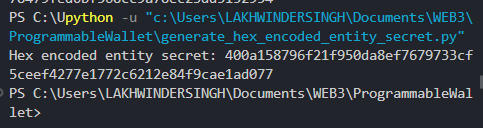
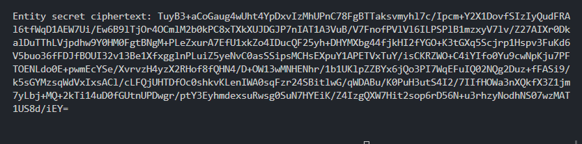
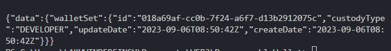
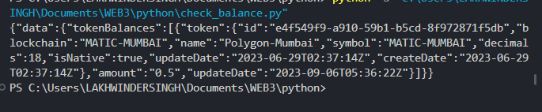

# Programmable Wallet

Wallet to store digital cryptocurrency and makes wallet-to-wallet transactions using python.


## Set up

1. Create account [here](https://login.circle.com/) for Web3 Console Servies.

2. Create a Developer Account and acquire an API key in the Console. Refer [here](https://developers.circle.com/w3s/docs/circle-developer-account).

3. Install the python dependicies: 
```pip install pycryptodome requests beautifulsoup4```

4. Generate the hex-encoded entity secret:
```
python generate_hex_encoded_entity_secret.py
```

   


5. This key will be used in generating cipher text. We also need public key for this purpose. Replace the  API key in generate_public_key.py file and run the python script. 
```
python generate_public_key.py
```
6. Before generating the cipher text, replace the hex_encoded_entity_secret with your generated hex_encoded_entity_secret above. Then run 
```
python generate_entity_secret_ciphertext.py
```
You will get the ciphertext like this:


7. Input the entity secret ciphertext in the developer console [Configurator Page](https://console.circle.com/wallets/dev/configurator?_gl=1*1p1ge0i*_ga*MTg0OTY5NTI0MS4xNjkzOTUxNjA2*_ga_GJDVPCQNRV*MTY5Mzk4Njc4NC42LjEuMTY5Mzk4OTczNy42MC4wLjA.) and click Register. Refer [docs](https://developers.circle.com/w3s/docs/developer-controlled-wallet-quickstart). 

8. Create wallet set.
```
python create_wallet_set.py
```


9. To get wallet info run this command:
```
python get_wallet_set.py
```

10. To update the name, replace the name in update_wallet_sets.py.

11. To create wallet, update the blockchains array and count. You can set other variables too. Refer [here](https://developers.circle.com/w3s/reference/createdeveloperwallet).

12. Obtain MATIC tokens from the [Polygon Faucet](https://faucet.polygon.technology/) or [Mumbai Faucet](https://mumbaifaucet.com/) and send them to the wallets wallets.address from the previous steps response body. 

13. Yay! You just transferred your first wallet tokens to your wallet. You can use these to transfer balance to other wallets as well. Refer [docs](https://developers.circle.com/w3s/reference/createdeveloperwallet) to know more.

14. To check balance run this python script:
```
python check_wallet_balance.py
```

15. Other python scripts are available to check individual wallet set and wallet info. Please go through the official documention on the Circle's official Website.

